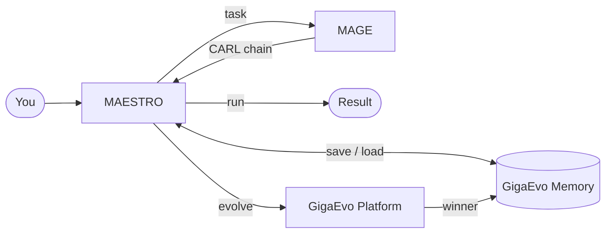

**MAESTRO** is the system at the top of a four-part stack — you use it through the
**MAESTRO CARE** TUI and the `care` CLI. Each part owns one stage of a chain's life.

| Part | Package | Stage | Role |
| --- | --- | --- | --- |
| **MAGE** | `mmar-mage` | Generation | Turns a natural-language task into a CARL chain. |
| **CARL** | `mmar-carl` | Chain format | The format every chain is written in — typed steps, dependencies (DAG), and per-step context. See the [CARL docs](/carl/getting-started/overview/). |
| **GigaEvo Memory** | `gigaevo-client` | Persistence | Stores entities (chain / agent / agent_skill / memory_card), the library, run history. |
| **GigaEvo Platform** | — | Evolution | Genetic search over chains; accept-and-promote the winner. |

## The lifecycle

1. **Generation** — describe a task; MAGE plans a CARL chain.
2. **Execution** — MAESTRO runs the chain and returns a result (with a token/cost trail).
3. **Persistence** — in Production mode, MAESTRO saves the chain to Memory
   under a stable `chain_id` and records each run.
4. **Evolution** — optionally, Platform runs a GA over the chain and the best
   individual is accepted back into the stable channel.

## Canonical flow

Generate Agent A → save it → generate B and C → return to A from the
[Library](/care/tui/screens/) → re-run from the same task and context files →
optionally evolve A and accept the best individual back into the stable channel.

## Graceful degradation

MAESTRO imports every upstream module **lazily** — inside the function that
needs it. So a minimal install still boots the CLI and TUI; a missing piece (e.g.
the optional `maestro-care[carl]` extra, or an unconfigured Memory URL) surfaces as a
friendly hint rather than a crash. Without Memory configured, Production mode
auto-falls back to [Ad-Hoc](/care/getting-started/overview/).

## See also

- [What is MAESTRO?](/care/getting-started/overview/) — modes and the big picture.
- [CARL](/carl/getting-started/overview/) — the chain format, documented in full.
