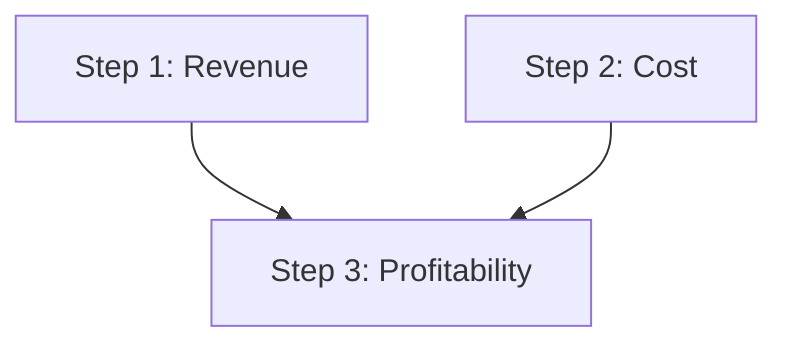

A few ideas explain almost everything in CARL.

## ReasoningChain

A **chain** is an ordered list of step descriptions plus execution settings
(`max_workers`, search config, metrics, replan policy, timeout). It is the main
public API and serialises to/from JSON for reuse.

## Steps

Each **step** is a typed description of one unit of reasoning. Steps share common
fields — `number`, `title`, `dependencies`, `metrics`, per-step `llm_config`,
`retry_max`, `timeout`, `cache`, `loop_config` — and add type-specific config.
Step types include `LLMStepDescription`, `ToolStepDescription`,
`MemoryStepDescription`, `TransformStepDescription`, `ConditionalStepDescription`,
`StructuredOutputStepDescription`, `AgentSkillStepDescription`, and the
multi-agent steps.

## DAG-based parallel execution

Steps declare `dependencies=[...]`. The **DAGExecutor** groups them into batches:
steps with no unmet dependencies run first, in parallel; later batches wait only
for what they actually depend on.

```python
LLMStepDescription(number=1, title="Revenue analysis", dependencies=[])
LLMStepDescription(number=2, title="Cost analysis",    dependencies=[])
# Step 3 waits for both 1 and 2:
LLMStepDescription(number=3, title="Profitability",    dependencies=[1, 2])
```

Steps 1 and 2 run together in the first batch; step 3 waits for both:



## RAG-like context extraction

Each LLM step can declare `step_context_queries`. For every query, CARL searches
your `outer_context` (substring or vector) and injects the matching snippets into
that step's prompt — so each step sees only the context it needs.

## ReasoningContext & ReasoningResult

The **context** carries execution state: the input (`outer_context`), the LLM
client (`api`), `language`, `system_prompt`, history, namespaced memory, the tool
registry, and monitoring callbacks. Running a chain returns a **ReasoningResult**
with `success`, `get_final_output()`, per-step results, token usage, and a full
execution `trace`.

:::tip
Dynamic references let later steps read earlier output: `$history[-1]`,
`$memory.namespace.key`, `$outer_context`, and more.
:::
