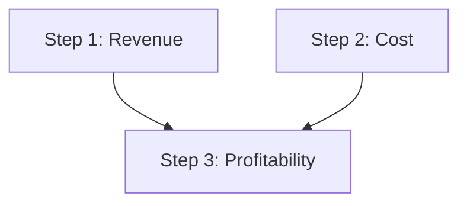

Несколько идей объясняют почти всё в CARL.

## ReasoningChain

**Цепочка** — это упорядоченный список описаний шагов плюс настройки исполнения
(`max_workers`, конфиг поиска, метрики, политика replan, таймаут). Это основной
публичный API; цепочка сериализуется в JSON и обратно для переиспользования.

## Шаги

Каждый **шаг** — типизированное описание одной единицы reasoning. Шаги имеют общие
поля — `number`, `title`, `dependencies`, `metrics`, пошаговый `llm_config`,
`retry_max`, `timeout`, `cache`, `loop_config` — и добавляют конфиг под свой тип.
Типы шагов: `LLMStepDescription`, `ToolStepDescription`, `MemoryStepDescription`,
`TransformStepDescription`, `ConditionalStepDescription`,
`StructuredOutputStepDescription`, `AgentSkillStepDescription` и мульти-агентные шаги.

## Параллельное исполнение на DAG

Шаги объявляют `dependencies=[...]`. **DAGExecutor** группирует их в батчи: шаги
без невыполненных зависимостей запускаются первыми и параллельно; следующие батчи
ждут только то, от чего реально зависят.

```python
LLMStepDescription(number=1, title="Анализ выручки", dependencies=[])
LLMStepDescription(number=2, title="Анализ затрат",  dependencies=[])
# Шаг 3 ждёт и 1, и 2:
LLMStepDescription(number=3, title="Прибыльность",   dependencies=[1, 2])
```

Шаги 1 и 2 выполняются вместе в первом батче; шаг 3 ждёт оба:



## RAG-извлечение контекста

Каждый LLM-шаг может объявить `step_context_queries`. По каждому запросу CARL ищет
в вашем `outer_context` (substring или вектор) и вставляет найденные фрагменты в
промпт этого шага — так каждый шаг видит только нужный ему контекст.

## ReasoningContext и ReasoningResult

**Контекст** несёт состояние исполнения: вход (`outer_context`), LLM-клиент
(`api`), `language`, `system_prompt`, историю, память по namespace, реестр
инструментов и колбэки мониторинга. Запуск цепочки возвращает **ReasoningResult**
с `success`, `get_final_output()`, результатами по шагам, расходом токенов и
полным трейсом исполнения.

:::tip
Динамические ссылки позволяют поздним шагам читать ранний вывод: `$history[-1]`,
`$memory.namespace.key`, `$outer_context` и другие.
:::
